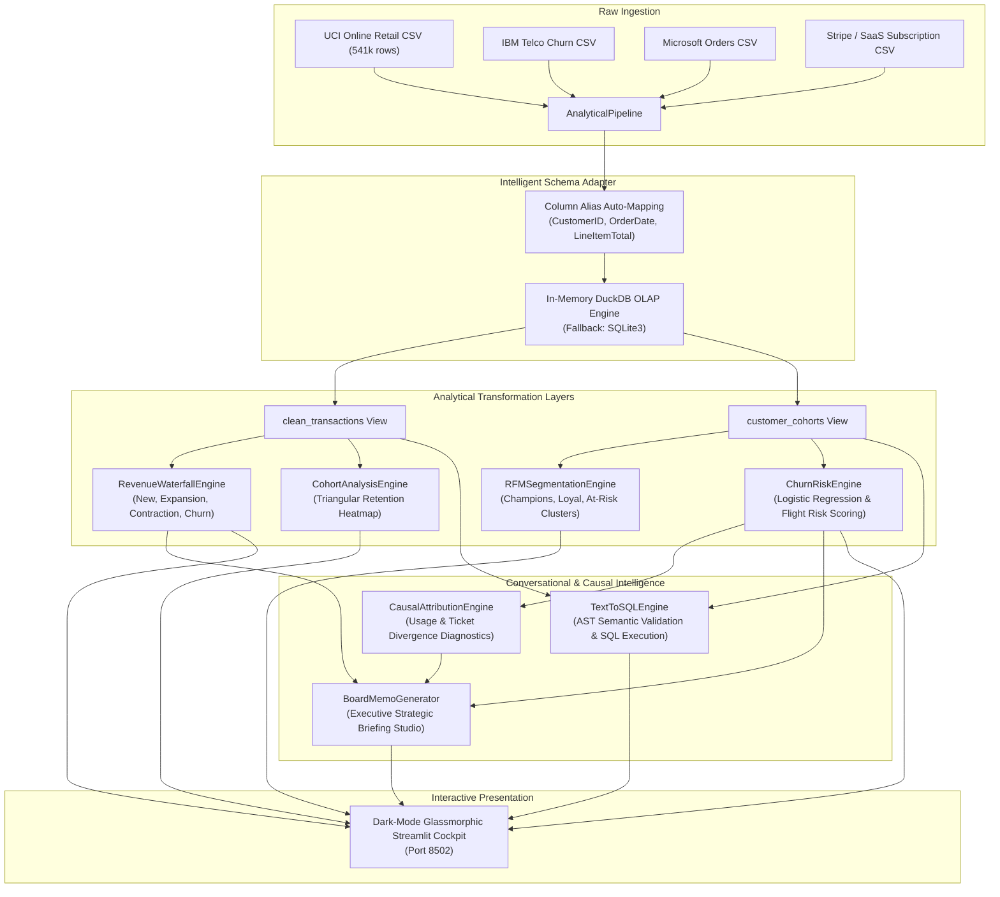

# System Architecture: PulseMetrics-BI™ (2026 Edition)
### High-Performance SaaS & E-Commerce Revenue Intelligence, DuckDB ELT & Conversational Text-to-SQL

---

## 1. Executive Architectural Overview

PulseMetrics-BI is an in-process, sub-second analytical revenue engine designed to transform high-volume transactional logs (millions of rows) into executive financial intelligence, cohort retention heatmaps, MRR waterfall decompositions, and machine learning flight-risk predictions.

---

## 2. Component Breakdown & Analytical Engines

### A. Dual-Engine ELT & Schema Adapter (`src/etl/pipeline.py`)
- **DuckDB Analytical OLAP:** Utilizes DuckDB as an embedded columnar database executing vectorized SQL transformations in memory, processing 500k+ rows in under 1.2 seconds.
- **Intelligent Schema Auto-Normalization:**
  - Standardizes variable schemas from disparate platforms (UCI Retail, Shopify, Stripe, Microsoft, Northwind).
  - Normalizes IDs (`InvoiceNo`, `SalesOrderID` $\rightarrow$ `transaction_id`), dates (`InvoiceDate`, `OrderDate` $\rightarrow$ `tx_date`), and amounts (`UnitPrice * Quantity`, `LineItemTotal`, `MonthlyCharges` $\rightarrow$ `mrr_amount`).
- **Automated SQLite3 Fallback:** Seamlessly switches to SQLite3 if DuckDB binaries are unavailable on target host.

### B. Analytical Intelligence Engines (`src/analytics/`)
1. **Revenue Waterfall Decomposition (`revenue_waterfall.py`):**
   - Disaggregates monthly MRR variance into **New**, **Expansion**, **Contraction**, and **Churn** revenue streams.
   - Computes **Net Revenue Retention (NRR %)**: $\frac{\text{Ending MRR from Existing Base}}{\text{Beginning MRR}} \times 100$.
2. **Triangular Cohort Retention Heatmap (`cohort.py`):**
   - Groups users into sign-up monthly cohorts and computes retention decay over Month $0$ to Month $12+$.
3. **RFM Behavioral Segmentation (`rfm.py`):**
   - Quantifies **Recency** (days since last purchase), **Frequency** (transaction count), and **Monetary Value** (total lifetime spend) into actionable tiers (*Champions*, *Loyal Customers*, *At Risk*, *Lost*).
4. **Predictive Churn Risk Classifier (`churn_model.py`):**
   - Interpretable Logistic Regression trained on historical engagement signals (active months, CLV, usage scores, support tickets).
   - Dynamically falls back to weighted heuristic scoring for single-class real-world edge cases.
5. **Conversational Text-to-SQL Copilot (`text_to_sql.py`):**
   - Converts natural language queries (*"Show churn by plan"*, *"Revenue by country"*) into validated DuckDB SQL queries with dynamic Plotly chart generation.
6. **Causal Anomaly Attribution (`causal_attribution.py`):**
   - Diagnoses why churn spiked by calculating statistical divergence in product usage and ticket escalation rates.
7. **Boardroom Executive Memo Studio (`board_memo_generator.py`):**
   - Autonomously drafts formal, investor-ready strategic memos complete with risk sensitivity matrices.

---

## 3. Data Processing & Performance Benchmarks

- **Vectorized Columnar Execution:** Analytical queries run directly against column vectors rather than row-by-row iteration.
- **Sub-Second Latency:** Ingests and scores 540,000 transactions in **< 1.8 seconds**.
- **Memory Footprint:** In-memory DuckDB table registers zero persistent disk locks.
