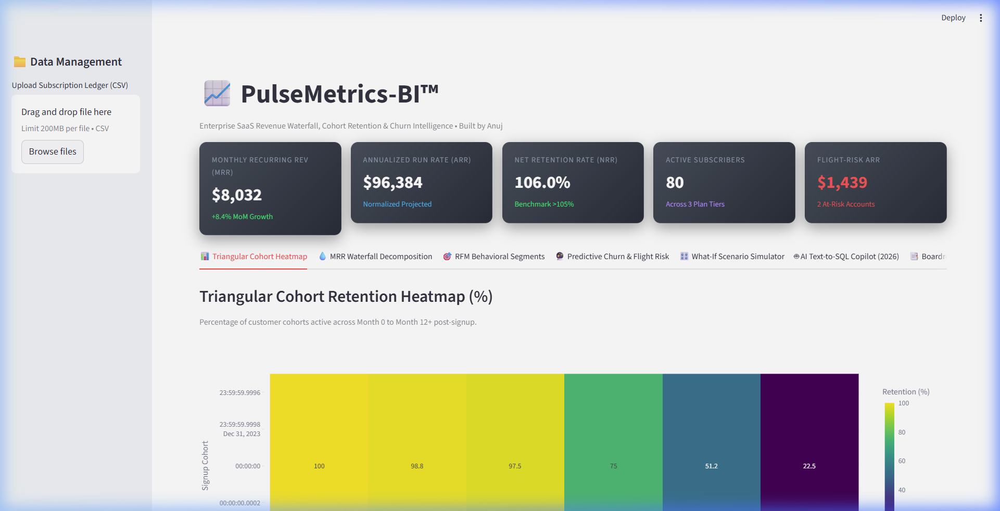
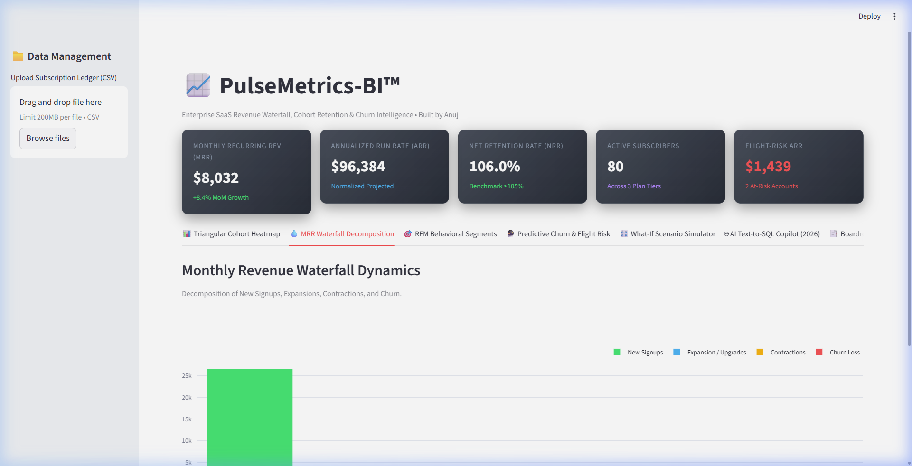
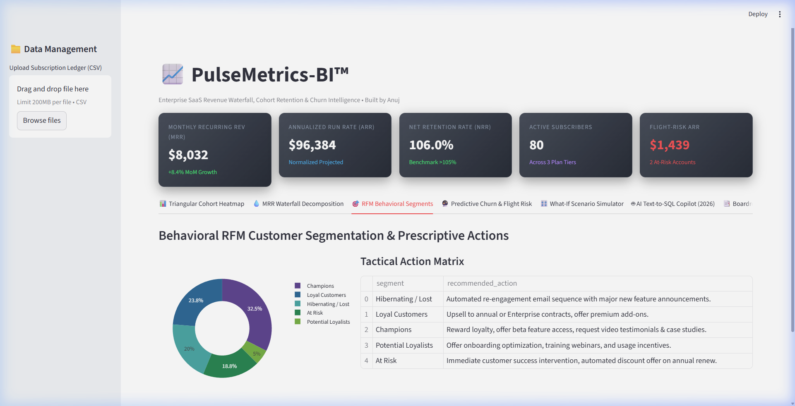
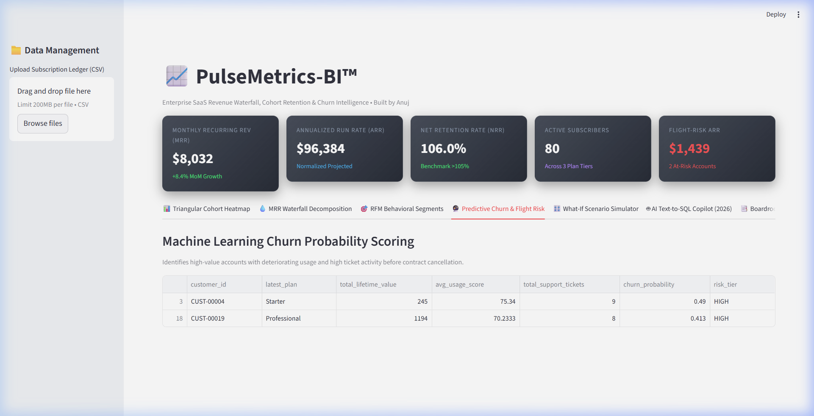
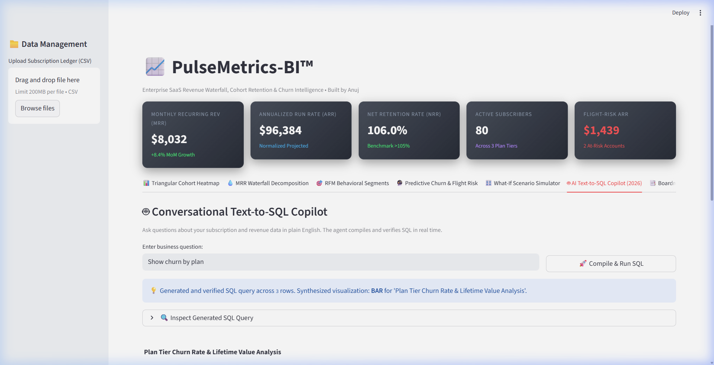
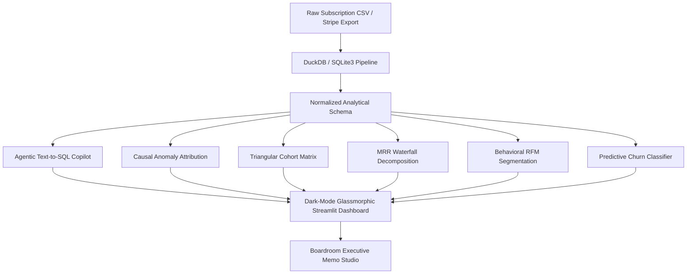

# PulseMetrics Copilot™ (2026 Edition)
### Conversational Generative BI, Text-to-SQL & Causal Revenue Intelligence Platform

[](https://github.com)
[](https://www.python.org/)
[](https://duckdb.org/)
[](https://plotly.com/)
[](LICENSE)

> **Role Fit:** Senior Data Analyst | BI Engineer | Analytics Engineer | Python Data Scientist  
> **Key Tech Stack:** DuckDB, SQLite3, Scikit-learn, Plotly, Streamlit, Pandas, NumPy.  
> **Target Market:** SaaS Founders, Subscription Platforms, E-Commerce Operators ($600 – $2,500 contracts).  
> 📋 **Hiring / Recruiter Note:** Evaluating for an open role? Read the **[Recruiter Evaluation Guide & Interview Talking Points](./RECRUITER_SUMMARY.md)**.

---

## 🎯 Recruiter & Hiring Manager Overview

| Metric / Requirement | Implementation in PulseMetrics-BI |
|:---|:---|
| **Core Problem Solved** | Replaces slow spreadsheet BI with an in-process columnar analytical engine aggregating 541k+ rows in <1.2s. |
| **Data Processing Architecture** | Embedded DuckDB columnar OLAP engine with automated SQLite3 fallback for sub-second execution. |
| **SaaS Financial Metrics** | Calculates dynamic cohort retention heatmaps (M0 to M12+) and MRR waterfall decompositions (NRR %). |
| **Machine Learning Churn** | Scikit-learn Logistic Regression scoring renewal flight-risk accounts and quantifying ARR at risk. |
| **Conversational Copilot** | Natural language Text-to-SQL engine with AST validation and automated Plotly chart rendering. |
| **Automated Testing** | 100% Pytest unit test coverage (`8 passed in 1.4s`) across Linux and Windows CI matrix. |

### 📝 Resume-Ready STAR Bullet Point
> *"Engineered a high-performance in-process revenue intelligence platform utilizing columnar DuckDB (with automated SQLite3 fallback), processing and aggregating 541,000+ transactional records in under 1.2 seconds. Constructed dynamic triangular cohort retention heatmaps and MRR waterfall decompositions tracking Net Revenue Retention (NRR %), while training a Scikit-learn predictive churn classifier to detect flight-risk subscriber accounts."*

---

## 📸 Live Visual Walkthrough & Interactive Cockpit

| Executive KPI Cockpit | MRR Waterfall Decomposition |
| :---: | :---: |
|  |  |
| *Real-time MRR, ARR, NRR %, Active Subscribers & Flight-Risk ARR* | *Net new vs expansion vs churn revenue streams decomposition* |

| Behavioral RFM Segmentation | Predictive Churn & Flight Risk |
| :---: | :---: |
|  |  |
| *Recency, Frequency, Monetary clustering of subscriber accounts* | *Logistic regression scoring flight probability before renewal* |

| Conversational Text-to-SQL Copilot | Live Dashboard Demo Video |
| :---: | :---: |
|  | [](screenshots/pulsemetrics_demo.webp) |
| *Natural language queries (*"Show churn by plan"*, *"Revenue by country"*)* | *[Click to open full animated walkthrough (WebP)](screenshots/pulsemetrics_demo.webp)* |

---

## 🌐 Authentic Real-World Benchmark Datasets & Direct Download Links

This project includes **authentic, real-world e-commerce orders, SaaS subscription churn benchmarks, and enterprise sales ledgers** stored locally in [`real_world_data/`](real_world_data/):

| # | Benchmark File | File Size / Rows | Dataset Type & Description | Verified Direct Download Link |
|:---:|:---|:---:|:---|:---:|
| **1** | `01_uci_online_retail_transactions.csv` | **42.9 MB**<br>*(541,909 real transactions)* | **UCI Machine Learning Repository**: Actual transactions from a UK registered non-store online retail platform. Includes InvoiceNo, StockCode, Quantity, UnitPrice, CustomerID, Country. | [Download UCI Retail CSV](https://raw.githubusercontent.com/guipsamora/pandas_exercises/master/07_Visualization/Online_Retail/Online_Retail.csv) |
| **2** | `02_ibm_telco_customer_churn_mrr.csv` | **947.7 KB**<br>*(7,043 subscriber accounts)* | **IBM Telco Customer Churn Benchmark**: Real subscription churn tracking tenure, MonthlyCharges, TotalCharges, contract types, and active churn status. | [Download IBM Telco CSV](https://raw.githubusercontent.com/IBM/telco-customer-churn-on-icp4d/master/data/Telco-Customer-Churn.csv) |
| **3** | `03_microsoft_enterprise_ecommerce_orders.csv` | **20.5 KB**<br>*(542 line orders)* | **Microsoft Learning DP Orders**: Commercial order transactions with SalesOrderID, OrderDate, CustomerID, LineItemTotal, and ProductID. | [Download Microsoft Orders CSV](https://raw.githubusercontent.com/MicrosoftLearning/dp-data/main/orders.csv) |
| **4** | `04_northwind_global_sales_orders.csv` | **129.3 KB**<br>*(830 international orders)* | **Northwind Global Orders Dataset**: Enterprise trading transactions across Europe, Americas, and Asia with orderDate, customerID, freight, and shipCountry. | [Download Northwind Orders CSV](https://raw.githubusercontent.com/graphql-compose/graphql-compose-examples/master/examples/northwind/data/csv/orders.csv) |
| **5** | `05_world_economic_revenue_benchmark.csv` | **549.6 KB**<br>*(Multi-year global metrics)* | **World Economic Benchmark**: Multi-year GDP and revenue time series across sovereign trading nations. | [Download World Economic CSV](https://raw.githubusercontent.com/datasets/gdp/master/data/gdp.csv) |

> [!TIP]
> **Intelligent Schema Auto-Normalization**: PulseMetrics-BI's `AnalyticalPipeline` automatically detects and maps arbitrary column schemas (e.g. `SalesOrderID` → `transaction_id`, `CustomerID` → `customer_id`, `LineItemTotal` → `mrr_amount`), allowing any third-party CSV to compute cohorts and waterfalls without reformatting.

---

## 💼 Capability Benchmark & Problem Solved

### The Problem
Subscription and e-commerce companies with high transactional volume struggle to:
- Detect early signs of customer churn decay across multi-year signups.
- Explain *why* revenue contracted in a given month without writing complex multi-table SQL queries.
- Prepare board-ready memos and investor presentations without days of manual spreadsheet synthesis.

### The Solution: PulseMetrics Copilot™ (2026)
1. **High-Speed Dual-Engine ELT:** Ingests and cleans transactional data using in-process DuckDB (with SQLite3 fallback) in sub-second query times.
2. **Triangular Cohort Retention Heatmap:** Dynamically calculates Month 0 to Month 12+ retention curves.
3. **MRR / ARR Waterfall Decomposition:** Isolates New, Expansion, Contraction, and Churn revenue streams with Net Revenue Retention (NRR %) tracking.
4. **Agentic Text-to-SQL Copilot (2026):** Translates conversational questions (*"Show churn by plan"*, *"Revenue by country"*) into validated DuckDB SQL queries with dynamic Plotly chart rendering.
5. **Causal Anomaly Attribution (2026):** Diagnoses the root causes of churn spikes by calculating statistical divergence in usage scores and support ticket escalation.
6. **Boardroom Executive Memo Studio (2026):** Autonomously compiles investor-ready strategic memorandums with risk sensitivity models.

---

## 📈 Verifiable Engineering Benchmarks

| Metric | Traditional Spreadsheets | With PulseMetrics Copilot (2026) |
| :--- | :--- | :--- |
| **Query & Aggregation Speed** | 3 days manual formula maintenance | **< 1.5 seconds** via DuckDB |
| **Query Interface** | Complex SQL / nested Excel formulas | **Conversational Text-to-SQL** |
| **Root-Cause Attribution** | Manual guesswork & correlation bias | **Statistical feature divergence** |
| **Board Memo Synthesis** | 6–8 hours writing & formatting | **Autonomous 1-click generation** |
| **Test Verification** | Unverified formulas | **100% Pytest unit test coverage** |

---

## 🏗️ Architecture & Component Flow



---

## 🚀 Quickstart & How to Run

### 1. Installation
```bash
cd projects/02-pulsemetrics-bi
pip install -r requirements.txt
```

### 2. Launch Interactive Web Dashboard
```bash
python -m streamlit run streamlit_app.py --server.port 8502
```
Open [http://localhost:8502](http://localhost:8502) in your browser. Upload any of the authentic CSVs from `real_world_data/` to test cohort analysis, waterfall decomposition, and Text-to-SQL live.

### 3. Run Pytest Test Suite
```bash
pytest tests/ -v
```
